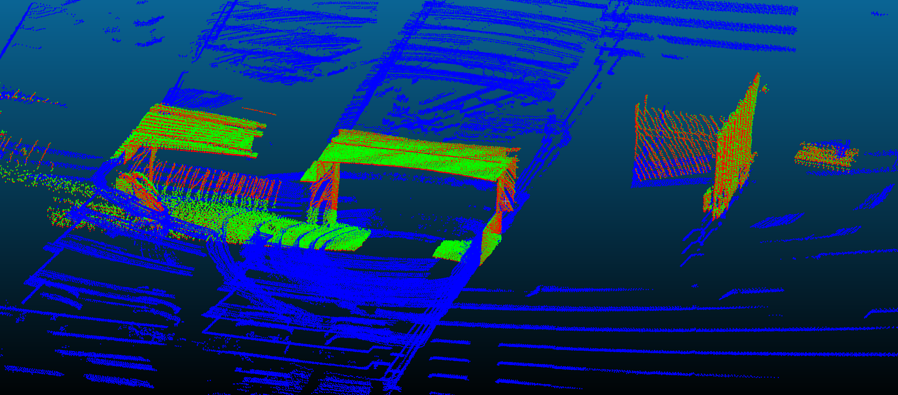

# lidar_to_lidar_calibrator

**tl;dr**: A simple tool for calibrating two lidars to each other using a single high-rate trajectory (e.g., from SLAM). This works by using the trajectory to aggregate local scans for each lidar across the entire trajectory, then running scan registration between all aggregated scans and optimizing for the calibration that minimizes the sum of these scan registration measurements.



## Goal

The goal of this tool is to calibrate the extrinsics of lidars using data that has already been collected, which is not a calibration specific dataset. This means you do not need to go collect a calibration-specific dataset with targets and use one of the few existing target-based lidar calibrators. This is useful if you are using an online dataset which does not have good extrinsics, or if you collected data already and were unable to get results from a target-based calibrator.

By combining this calibrator with the [camera_to_map_calibrator](https://github.com/nickcharron/camera_to_map_calibrator), you should be able to take any camera + lidar dataset that you can run slam on, and calibrate for all transforms between the lidars and cameras.

**Caviats**: 

* Must have high-rate (e.g., IMU rate) trajectory. There are an abundance of open-source lidar-slam (e.g., [LIO-SAM](https://github.com/TixiaoShan/LIO-SAM), [LeGO-LOAM](https://github.com/RobustFieldAutonomyLab/LeGO-LOAM), [Direct LiDAR Odometry](https://github.com/vectr-ucla/direct_lidar_odometry))
* You must have a good initial guess of the extrinsics, or the registration won't be robust. Usually hand-measurements are good enough to get an initial estimate.

## Dependencies

This repo only depends on our internal [libbeam](https://github.com/BEAMRobotics/libbeam) library. 

Libeam depends on the following:

* [ROS](https://www.ros.org/)
* [Catch2](https://github.com/catchorg/Catch2)
* [Eigen3](https://gitlab.com/libeigen/eigen/)
* [PCL 1.11.1 or greater](https://github.com/PointCloudLibrary/pcl)
* [gflags](https://github.com/gflags/gflags)
* [nlohmann json](https://github.com/nlohmann/json)

For more information on libbeam and it's dependencies, see the [docs](https://github.com/BEAMRobotics/libbeam). 

## Install

First, install the libbeam dependencies. We have a [script](https://github.com/BEAMRobotics/libbeam/blob/master/scripts/install.bash) to help make this easier which you can run, or just copy commands from.

We recommend using catkin to build this tool and libbeam.

```
mkdir -p ~/l2l_calib_catkin_ws/src
cd ~/l2l_calib_catkin_ws
catkin build -j2
```

Clone libbeam and this repo:

```
cd ~/l2l_calib_catkin_ws/src
git clone --depth 1 https://github.com/BEAMRobotics/libbeam.git
git clone --depth 1 https://github.com/nickcharron/lidar_to_lidar_calibrator.git
```

Build:

```
cd ~/l2l_calib_catkin_ws/
catkin build -j2
```

## Running the tool

For information on required inputs to the binary and their formats, run the binary with -help flag:

```
cd ~/l2l_calib_catkin_ws/
./build/lidar_to_lidar_calibrator/lidar_to_lidar_calibrator_main -help
```

The tool offers an option to display the measurements and manually accept/reject each one. This slows down the process, but can be useful to make sure you get good results and also make sure your initial extrinsics and poses are good. Note that there are some methods built-in to try to automatically detect bad registrations and remove these from the measurements and this works relatively well.

## Example Tutorial

Download the example data from [here](https://drive.google.com/drive/folders/1Du42p_wja2zZsqwS4ZEav5opitUv-DqT?usp=sharing)

Run the script at examples/parking_garage_vlp16s/run_example.sh:

```
cd ~/l2l_calib_catkin_ws/src/lidar_to_lidar_calibrator
bash examples/parking_garage_vlp16s/run_example.sh ./build ~/path_to_example_data
```

